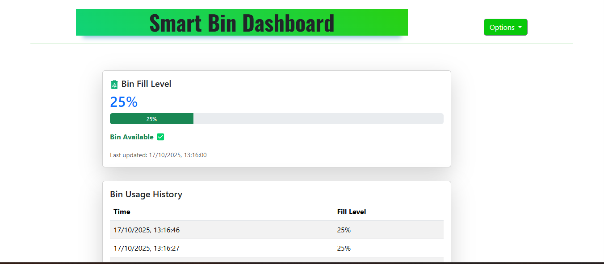
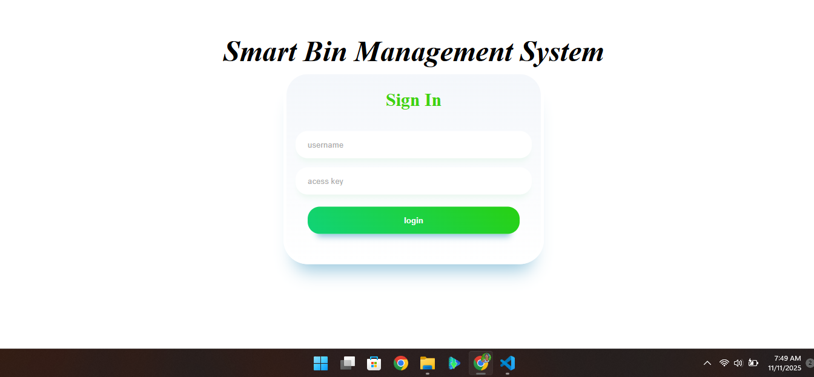

# 🗑️ Smart Bin Management System (SBMS)

---

## 💡 Problem Statement
In many public and institutional spaces, bins often overflow due to poor monitoring, leading to unsanitary conditions.  
Traditional bins lack real-time monitoring and notifications, causing delays in waste collection.

**SBMS** solves this by:
- Monitoring the bin fill level continuously using an ultrasonic sensor.
- Automatically preventing the lid from opening once the bin reaches 80% capacity.
- Sending live updates to an online dashboard every 5 seconds.
- Allowing users to report full bins directly to collection staff through email alerts.

---

## 🧰 Tech Stack

### 💻 **Software & Web Stack**
| Purpose | Technology |
|----------|-------------|
| Backend | Node.js, Express.js |
| Frontend | EJS Templates, HTML, CSS, JavaScript |
| Database | PostgreSQL |
| Authentication | bcrypt, express-session |
| Email Service | Nodemailer (Gmail SMTP) |
| Environment Config | dotenv |
| Visualization | Dynamic Dashboard with live data refresh (AJAX/Fetch) |

### ⚙️ **Hardware & Embedded Stack**
| Purpose | Component / Library |
|----------|---------------------|
| Microcontroller | ESP32 |
| Sensors | Ultrasonic (HC-SR04), PIR Motion Sensor |
| Actuators | Servo Motor (for auto-lid), Buzzer |
| Display | 16x2 LCD (I2C) |
| Connectivity | Wi-Fi (HTTP POST to server) |
| Language | C++ (Arduino Framework) |

---


## ✨ Key Features
- ✅ Real-time bin level monitoring (5s updates)
- ✅ Automatic lid control (servo motor)
- ✅ Overflow prevention (80% capacity lock)
- ✅ Email alerts for maintenance staff
- ✅ Live web dashboard with visualization
- ✅ User authentication system

  
---

### Hardware Setup


### Web Dashboard


---

## 🧩 System Architecture

```plaintext
 ┌─────────────────────┐        ┌─────────────────────────────┐        ┌─────────────────────────────┐
 │  Smart Bin (ESP32)  │ --->   │  Express.js REST API Server │ --->   │  PostgreSQL Database        │
 │  - Sensors + Servo  │        │  - Data Handling + Auth     │        │  - bin_data, userdetails    │
 └─────────────────────┘        └─────────────────────────────┘        └─────────────────────────────┘
             │                           │
             ▼                           ▼
         LCD Display               Web Dashboard (EJS)
         Real-time bin info        Live bin levels + Alerts
